<div id="top"></div>

<!-- PROJECT LOGO -->
<br />
<div align="center">
    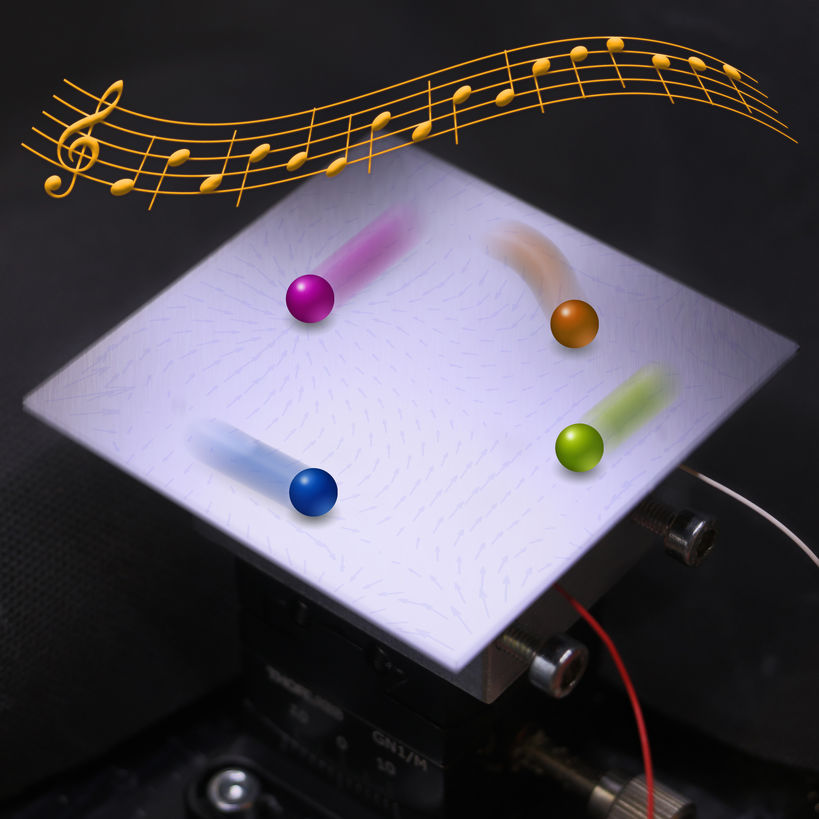

<h2 align="center">AcoBot Web Application</h2>
  <br/>
  <p align="center">
    This project is an interactive web application to remotely control an easy-to-assemble setup that contains a commercial Chladni plate, a camera, and a vibration generator. The application allows remote multiple-user access to the setup, including a number of functions, such as multiple particles manipulation and execution of user-specified commands on the plate, as well as video recording and live streaming. Together with the setup, the web application constitutes an easy-to-assemble robotic kit that can be used both in educational and research activities.

  </p>
</div>

<!-- TABLE OF CONTENTS -->
<details>
  <summary>Table of Contents</summary>
  <ol>
    <li>
      <a href="#about-the-project">About The Project</a>
      <ul>
        <li><a href="#theory">Theory</a></li>
        <li><a href="#hardware">Hardware</a></li>
        <li><a href="#built-with">Built With</a></li>
      </ul>
    </li>
    <li>
      <a href="#installation">Installation</a>
    </li>
    <li><a href="#usage">Usage</a></li>
    <li>
      <a href="#how-to-update-code">How to update code</a>
      <ul>
        <li><a href="#how-to-update-backend-part">How to update backend part</a></li>
        <li><a href="#how-to-update-frontend-part">How to update frontend</a></li>
      </ul>
    </li>
  </ol>
</details>

<!-- ABOUT THE PROJECT -->
<br />

## About The Project

<br /><br />

<div align="center">
    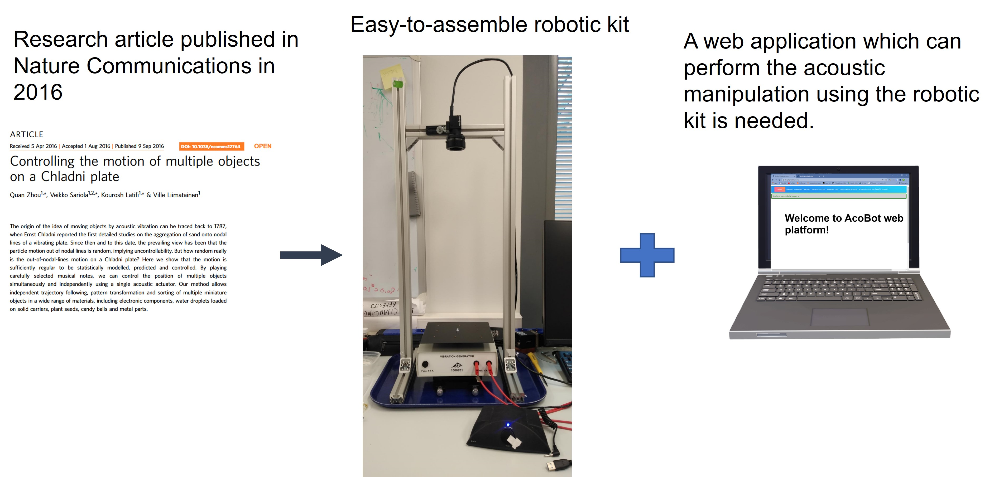
</div>

This project is to build a web application for the simplified robotic instrument used for acoustic manipulation method introduced in the [research article](https://www.nature.com/articles/ncomms12764) published in Nature Communications in 2016.

### Theory

Acoustic manipulation on a vibrating plate is a technique that moves objects on a Chladni plate by sound. A Chladni plate is a centrally actuated vibrating plate, a classic acoustic manipulation device.

The research in acoustic manipulation on the [Robotic Instruments Group](https://www.aalto.fi/en/department-of-electrical-engineering-and-automation/robotic-instruments) showed that the movement of particles on the vibrating plate before they settle on the nodal line is not random and can be statistically predicted and controlled. They introduced a novel approach to control the motion of multiple particles simultaneously and independently on the vibrating plate using only one acoustic actuator. By using a data-driven model to select the frequency of excitation in each control step, the positions of multiple particles on the vibrating plate are simultaneously and independently controlled to the desired position. The schematic of the method and a manipulation example are presented in following figure.
<br />

<div align="center">
    
</div>

The whole process of acoustic manipulation can be divided into four steps:

  <div id="Amplitude experiment"></div>

- Amplitude experiment: To achieve the identical nominal average displacement of the particles, the vibration amplitude is iteratively tuned for each frequency.

  <div id="Data collecting"></div>

- Data collecting: the displacement of the particles can be obtained by tracking the particle position before and after the excitation. Therefore, a database of the particle position, the frequency of the excited signals, and the resulted displacements can be collected by repeatedly exciting the plate.

  <div id="Model fitting"></div>

- Model fitting: The experimental data can be used to establish a statistical model of the relationship between the particle displacement and the frequency of the excitation signals. In this manner, the motion of particles can be statistically predicted for a wide spectrum of frequencies.

  <div id="Object manipulation"></div>

- Object manipulation: the motion of the particles on the plate can be controlled by repeatedly measuring their position and by using the established model to choose the frequency of the signal that moves the particles towards the desired directions.

  <br />
  <div align="center">
      
  </div>

<p align="right">(<a href="#top">back to top</a>)</p>

### Hardware

<br />
  <div align="center">
      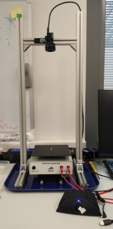
  </div>

- [Camera](https://www.flir.eu/products/blackfly-s-usb3/)

  The camera is mounted above the vibration generator and the plate with a full view of the plate. The camera is used to take images of the plate.

  - Model: Point Grey BlackFly
  - Specs: See Section 5
  - Lens: 18mm, c-connector
  <br />
  <div align="center">
      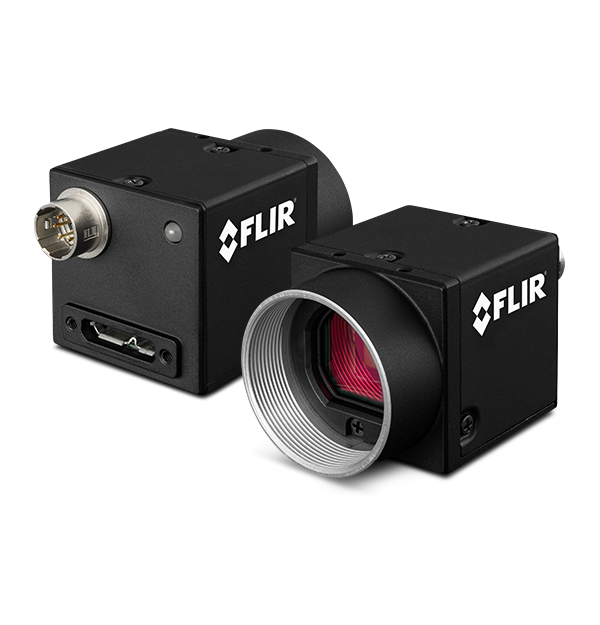
  </div>

- [Chladni Plate, Square](https://www.3bscientific.com/us/chladni-plate-square-1000706-u56006-3b-scientific,p_576_1982.html)

  - Model: 3B Scientific Chladni Plate, square 1000706
  - Material: Steel
  - Dimensions: 180 mm x 180 mm
  <br />
  <div align="center">
      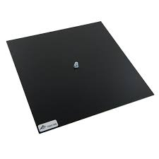
  </div>

- [Vibration Generator](https://www.3bscientific.com/us/vibration-generator-1000701-u56001-3b-scientific,p_576_1977.html#recommended)

  - Model: 3B Scientific Vibration Generator 1000701
  - Frequency range: 0 - 20 kHz
  - Input sockets: 4-mm safety sockets
  - Plate mounting pin: 4-mm socket
  - Impedance: 8 Ω
  - Dimensions: 200 x 160 x 75 mm3
  - Weight: 1.4 kg
  <br />
  <div align="center">
      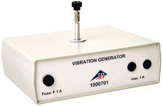
  </div>

- [Edmund optics tilt stage](https://www.edmundoptics.eu/p/30mm-metric-micrometer-tilt-stage/21039/)

  <br />
  <div align="center">
      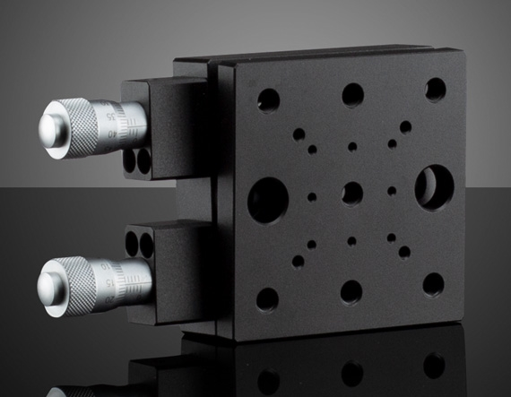
  </div>

- [Dayton Amplifier](https://www.daytonaudio.com/product/697/dta-1-class-d-digital-ac-dc-amplifier-15-wpc)

  - Input Connectors: 3.5mm Stereo
  - Frequency Response: 20 - 20,000 Hz
  - Amplifier Type: Mini Amplifiers
  - Power Output: 2 x 15 watts RMS
  - Output Connectors: Spring Loaded Terminals
  <br />
  <div align="center">
      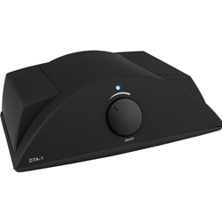
  </div>

### Built With

- [React.js](https://reactjs.org/)
- [Flask](https://flask.palletsprojects.com/)
- [Python 3.6](https://www.python.org/downloads/release/python-360//)
- [SQLite](https://www.sqlite.org/index.html)

<p align="right">(<a href="#top">back to top</a>)</p>

<!-- GETTING STARTED -->

## Installation

This is the instructions on setting up the project locally.
To get a local copy up and running, follow these steps.

1. Clone the repo and navigate to its directory.

   ```sh
   git clone https://version.aalto.fi/gitlab/acobotwebversion/acobot.git
   cd acobot
   ```

2. Create a virtual environment and install all dependencies inside the virtual environment using [conda](https://docs.conda.io/en/latest/miniconda.html).

   - Install [conda](https://docs.conda.io/en/latest/miniconda.html)
   - Create a virtual environment using acobot.yml file in the root folder.
     ```sh
     #Windows
     conda env create -f acobot.yml
     ```
   - Activate the virtual environment
     ```sh
     conda activate acobot
     ```

3. Install all PyCapture library in order to use the camera.

4. Init the database

   ```sh
   python -m flask db init
   python -m flask db Migrate
   python -m flask db upgrade
   ```

5. Start the server
   ```sh
   conda activate acobot
   python server.py
   ```
   Then, the application can is hosted on the address: http://127.0.0.1:5000 .
   <p align="right">(<a href="#top">back to top</a>)</p>

## Usage

Use this space to show useful examples of how a project can be used. Additional screenshots, code examples and demos work well in this space. You may also link to more resources.

1. Register and log in to the web application.
<br />
<div align="center">
    
</div>
<div align="center">
    
</div>

The entry point of the web application is the login page where users can log in to the application with the existing username and password or can create a new one by clicking sign-up button.

2. Camera interface

   - Play recorded videos: Click the 'load video from file' button to open the selection dialog, then select the video you want to play.
   <br />
   <div align="center">
       
   </div>

   - Play the live video: Click the 'camera' switch to open the camera. There are several features available when the camera is enabled, such as cropping the image size and recording the video.
     <br />
        <div align="center">
            
        </div>

     - Crop the image size: Draw a box with the specified size over the image, then click the 'crop' button.

        <br />
        <div align="center">
            
        </div>

     - Record video: Click the 'start record' button to start recording and click the 'stop record' button to stop recording.

        <br />
          <div align="center">
              
          </div>

3. Command execution

   In the command page, there is a code editor where users can in put the script which could be executed in the backend. The acceptable script can only include specified functions and users can view the whole function list by clicking the 'command list' button.

   <br />
   <div align="center">
        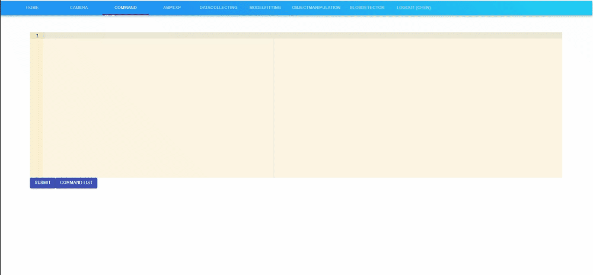
    </div>
    <div align="center">
        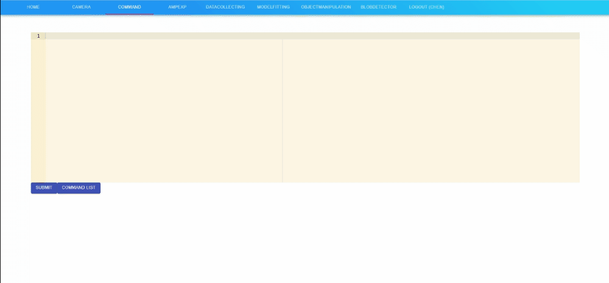
    </div>

4. Blob detector
   Users can control the parameters of the blob detector to accurately detect the objects on the vibrating plate.

  <br />
    <div align="center">
        
    </div>

5. Experiment conducting

- <a href="#Amplitude experiment">Amplitude experiment</a>: User can do the amplitude experiment using this application, and this is the basis of the following experiment.

  The web page also displays the messages sent from the server for the duration of the experiment including three levels: error messages, warning messages, and info messages. The error messages show the reason why the experiment is terminated, the warning messages show that the experiment is paused and needs to be resumed, and the info messages show the process status.

  - First, open the camera in the camera page.

  - Then, open the the setting panel to open the parameters form to set the parameters used in this experiment.

  - when ready, click the 'submit' button to submit these parameters to the server.

  - User can also see the parameter details by clicking the 'parameter info' button.

  - Finally, click the 'start amplitude experiment' button to start the experiment.
  <br />
  <div align="center">
      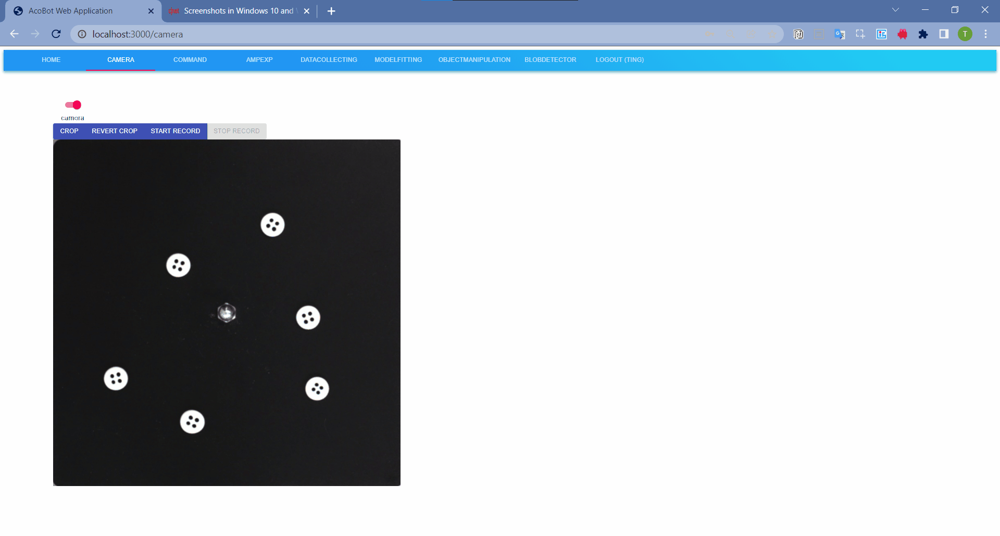
  </div>
  <br />

  > **_NOTE:_** When the experiment is finished, a folder containing all the images of the experiment will be created in the amp folder and a csv data file containing the tuned amplitudes data will be created in the tunedAmo folder. The data file will be useful in the following experiments.

- <a href="#Data Collecting">Data Collecting</a> : after finishing the amplitude experiment, users can collect the data of particle positions and displacements produced by signals of the amplitudes resulted from the amplitude experiment. The experiment results in a csv data file containing the displacements data of particles across the plate excited by signals of different frequencies and the corresponding amplitudes.

  - First, open the camera in the camera page.

  - Then, open the the setting panel to open the parameters form to set the parameters used in this experiment. There is one parameter to specify the file name of the tuned amplitude data file achieved from the <a href="#Amplitude experiment">Amplitude experiment</a>. So, in order to run this experiment, there must be at least one tune amplitude data file in the specified folder.

  - when ready, click the 'submit' button to submit these parameters to the server.

  - Finally, click the 'start data collecting' button to start the experiment.

  <br />
  <div align="center">
      
  </div>
  <br />

  > **_NOTE:_** When the experiment is finished, a folder containing all the images of the experiment will be created in the DataCollecting folder and a csv data file containing the collected displacement data will be created in the DataCollecting folder. The data file will be useful in the following experiment.

- <a href="#Model fitting">Model fitting</a>: Model fitting is the final preparation step before conducting the object manipulation experiment: the collected displacement data is fitted to a statistical model using the [LOWESS](https://www.itl.nist.gov/div898/handbook/pmd/section1/pmd144.htm) method (with degree=2, span=0.5).

  - First, choose the displacement data file achived from the <a href="#Data Collecting">Data Collecting</a>.

  - Click the 'start model fitting' button to start the experiment.
  <br />
  <div align="center">
      
  </div>
  <br />

  > **_NOTE:_** The out put of this experiment will be a fitted model file in the ModelFitting folder.

- <a href="#Object manipulation">Object manipulation</a>: The final goal of this project is that user can perform object manipulation experiment on the vibrating plate through the web application.

  - Open the Controller editor to edit your own controller if you want. The controller function must keep a specific form (the name and the arguments).

    ```py
    ################################################################
    ## you can edit the contents of the controller() function     ##
    ## stay the function name and the arguments unchanged         ##
    ################################################################
    def controller(targets,prepositions,model,freqNum,positionsArray):
          ...
          #targets is the targets array in form of [(0.2,0.1),(0.4,0.5)]
          #prepositions is the positions array before playing
          #model is the fitted model which is in form of python dict.
          #freqNum is the number of frequencies used in the model.
          #positionsArray is the historical positions array
          #dx = model['u'][freqId].reshape(-1,50)[xGrid,yGrid]
          #dy = model['u'][freqId].reshape(-1,50)[xGrid,yGrid]
    ```

  - Open camera.

  - Open the the setting panel to open the parameters form to set and submit the parameters used in this experiment.

  - Click the 'start object manipulation' button to start the experiment.

  <br />
  <div align="center">
      
  </div>
  <br />
  <br />
  <div align="center">
      
  </div>
  <br />

<p align="right">(<a href="#top">back to top</a>)</p>

## How to update code

<br/>

### How to update backend part

<br/>
The backend code is contained in this repository and its structure is shown in the following picture.

```
|-- acobot
    |-- acobot.yaml
    |-- amplitude_experiment_parameters.json
    |-- commandDoc.txt
    |-- config.py
    |-- readme.md
    |-- dict.txt
    |-- FlyCapture_2.13.3.31_x64.exe
    |-- PyCapture2-2.13.61.win-amd64-py3.6.msi
    |-- server.py
    |-- app
        |-- models.py
        |-- sockets.py
        |-- __init__.py
        |-- api
            |-- errors.py
            |-- global_variables.py
            |-- ampExp
              |-- routes.py
              |-- __init__.py
            |-- auth
              |-- routes.py
              |-- __init__.py
            |-- blobDetector
              |-- routes.py
              |-- __init__.py
            |-- command
              |-- routes.py
              |-- __init__.py
            |-- camera
              |-- routesCombine.py
              |-- __init__.py
            |-- dataCollecting
              |-- routesCombine.py
              |-- __init__.py
            |-- modelFitting
              |-- routesCombine.py
              |-- __init__.py
            |-- objectManipulation
              |-- routesCombine.py
              |-- __init__.py
        |-- hardware
            |-- controllers
              |--defualtController.py
            |--acoustic2Camera.py
            |--acoustic2Sound.py
            |-- ampMain.py
            |-- camera_opencv.py
            |-- dataCollection.py
            |-- funs.py
            |--modelFitting.py
            |--munkres_solver.py
            |-- objectManipulation.py
    |-- ampExp
    |-- DataCollecting
    |-- ModelFitting
    |-- tunedAmp
    |-- video
    |--images
```

- The acobot.yaml is used to create the virtual environment for the application using conda.

- The FlyCapture_2.13.3.31_x64.exe and PyCapture2-2.13.61.win-amd64-py3.6.msi files are the installer files for the pyCapture package.

- The server.py file in the top-level folder is used to launch the application.

- The config.py file is used to specify configuration options for the application.

- The amplitude_experiment_parameters.json, commandDoc.txt, config.py and dict.txt files are used inside the application.

- The build folder in the top-level folder contains the [production build](https://reactjs.org/docs/optimizing-performance.html#use-the-production-build) of the frontend part of the application which is created with command [npm run build](https://github.com/facebook/create-react-app#npm-run-build-or-yarn-build) in the [frontend part](https://version.aalto.fi/gitlab/acobotwebversion/acobot_frontend.git).

- The app folder contains the source code which contains the api folder and the hardware folder which contains scripts needed when run different experiment, e.g, the ampMain.py is used to start the <a href="#Amplitude experiment">Amplitude experiment</a>.
  And the api folder contains the the route functions for endpoint, e.g., the ampExp folder contains the route functions related to the request to the <a href="#Amplitude experiment">Amplitude experiment</a>.

- The rest of the other folders in the root folder contain the results of the experiments. For example, the ampExp folder contains the result of the <a href="#Amplitude experiment">Amplitude experiment</a>.

Developers can change the specific code in the app folder then restart the server.py again.

<p align="right">(<a href="#top">back to top</a>)</p>
<br/>

### How to update frontend part

<br/>
You can find the corresponding code of the frontend [here](https://version.aalto.fi/gitlab/acobotwebversion/acobot_frontend).

The structure of the frontend:

```
|-- 📂acobot-frontend
    |-- 📂build
        |--📂static
        |-- 📂css
        |-- 📂js
        |--📂media
        |-- 📂public
        |--📜index.html
        |--📜manifest.json
    |-- 📂src
        |-- 📂components
            |--📜AppTopBar.js
            |--📜ErrorNotification.js
            |--📜Notification.js
        |--📂images
            |--📜acoustic_manipulation.jpg
            |--📜butterflyBlob.png
            |--📜butterflyBlobChanged.png
            |--📜login.png
            |--📜videoStart.png
        |-- 📂pages
            |--📂AmpExp
                |--📜AlertForm.js
                |--📜AmpExp.css
                |--📜AmpExp.js
                |--📜Drawer.js
                |--📜index.js
            |--📂BlobDetector
                |--📜BlobDetector.css
                |--📜BlobDetector.js
                |--📜index.js
            |--📂Camera
                |--📜Camera.js
                |--📜index.js
            |--📂Command
                |--📜CodeEditor.js
                |--📜Command.css
                |--📜Command.js
                |--📜index.js
            |--📂DataCollecting
                |--📜DataCollecting.js
                |--📜index.js
            |--📂Home
                |--📜Home.js
                |--📜index.js
            |--📂Login
                |--📜index.js
                |--📜Login.css
                |--📜Login.js
                |--📜SignIn.js
                |--📜SignUp.js
            |-- 📂ModelFitting
                |--📜index.js
                |--📜ModelFitting.js
            |-- 📂ObjectManipulation
                |--📜index.js
                |--📜ObjectManipulation.js
            |--📂StudentPage
               |-- 📜Camera.js
               |--📜index.js
        |-- 📂services
            |--📜ampExp.js
            |--📜blobDetector.js
            |--📜camera.js
            |--📜command.js
            |--📜dataCollecting.js
            |--📜login.js
            |--📜modelFitting.js
            |--📜objectManipulation.js
        |--📂state
            |--📜index.js
            |--📜reducer.js
            |--📜state.js
        |--📂utils
             |--📜boxSelection.js
            |--📜serviceDispatch.js
        |-- 📜App.css
        |-- 📜App.js
        |-- 📜index.js
    |-- 📜.gitignore
    |-- 📜package-lock.json
    |-- 📜package.json
```

- The package.json file contains information about the frontend of the project, including the name and version of the application, the list of dependency packages and a set of useful development scripts for communicating with React.

- The public/index.html file defines a "div" element with its "id" set to "root" where all the components of the application are loaded into.

- The "src/index.js" accesses the "root" element from "public/index.html" so that the App Component can be loaded into the "root" HTML element. It also imports "src/App.js" file and creates the "< App />" element.

- While the "src/App.js" defines the App component which is the main component in React and acts as a container for all other sub-component ("X.js"). It also imports "src/service.js" to give access to the back-end API.
- The build folder contains the [production build](https://reactjs.org/docs/optimizing-performance.html#use-the-production-build) of the frontend which can be served in the [backend](https://version.aalto.fi/gitlab/acobotwebversion/acobot.git).

Steps to update the user interface of the application:

1. Make sure [npm](https://docs.npmjs.com/about-npm) is installed in your computer.
2. Clone the repository of the frontend.
   ```sh
   git clone https://version.aalto.fi/gitlab/acobotwebversion/acobot_frontend.git
   cd acobot_frontend
   ```
3. Install the dependencies.
   ```sh
   npm install
   ```
4. Make changes to the source code.
5. Created the [production build](https://reactjs.org/docs/optimizing-performance.html#use-the-production-build) of the updated version of frontend with command [npm run build](https://github.com/facebook/create-react-app#npm-run-build-or-yarn-build)
   ```sh
   npm  run build
   ```
6. Replace the build folder in the [backend](https://version.aalto.fi/gitlab/acobotwebversion/acobot.git) with the one created in the frontend.

<p align="right">(<a href="#top">back to top</a>)</p>
